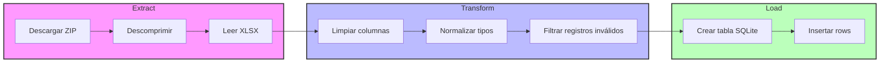
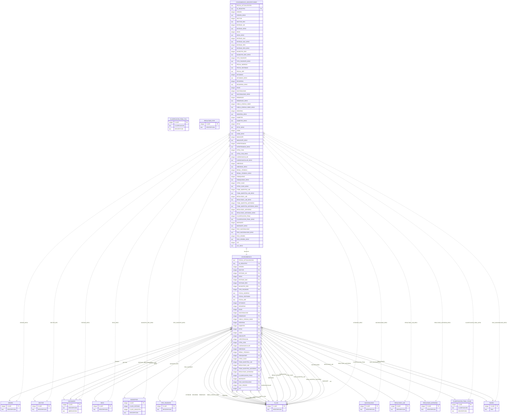

# 🦀 ETL COVID-19 México en Rust

[](https://opensource.org/licenses/MIT)
[](https://www.rust-lang.org/)

---

## 📖 Descripción general

Este proyecto implementa un **pipeline ETL** (Extracción, Transformación y Carga) para los datos oficiales de COVID‑19 en México. El código está escrito en **Rust** y procesa los datos de forma totalmente automática, almacenándolos en una base de datos **SQLite** local lista para análisis.

---

## 📑 Tabla de contenidos

1. [Arquitectura](#arquitectura)
2. [Extracción](#extracción)
3. [Transformación](#transformación)
4. [Carga](#carga)
5. [Requisitos](#requisitos)
6. [Uso rápido](#uso-rápido)
7. [Contribuir](#contribuir)
8. [Licencia](#licencia)

---

## 🏗️ Arquitectura



---

## 📥 Extracción

- **Fuente:** <https://www.gob.mx/salud/documentos/datos-abiertos-covid-19>
- Se descarga el archivo ZIP con `reqwest` (ver `src/download.rs`).
- El ZIP se descomprime usando `unzip` y se extrae el archivo XLSX (`src/unzip.rs`).
- El contenido XLSX se lee con la crate `calamine` (`src/xlxs_to_pl.rs`).

---

## 🔧 Transformación

- **Limpieza básica:**
  - Eliminación de filas con datos faltantes.
  - Normalización de fechas al formato `YYYY‑MM‑DD`.
  - Conversión de números a tipos apropiados (`i32`, `f64`).
- **Normalización de campos:**
  - Se unifican nombres de columnas a minúsculas y snake_case.
  - Se generan columnas auxiliares como `fecha_iso`.
- Todo el proceso está encapsulado en `src/pl_sql.rs` y `src/utils.rs`.

---

## 📤 Carga

- Se crea una base de datos SQLite (`data_covid19.mx.db`).
- La tabla principal `covid_cases` se define con los tipos apropiados.
- Los registros limpios se insertan mediante `rusqlite` en bloques de 1000 filas para rendimiento.

## 📊 Esquema de la base de datos



---

## ⚙️ Requisitos

- **Rust** (stable) – <https://www.rust-lang.org/tools/install>
- Conexión a internet (para la extracción).
- No se necesita instalación externa de SQLite; el driver se encarga de crear el archivo local.
- Dependencias declaradas en `Cargo.toml` (incluye `reqwest`, `tokio`, `calamine`, `rusqlite`, `color-eyre`).

---

## 🚀 Uso rápido

```bash
# Clonar el repositorio
git clone https://github.com/LuisFHernadezV/dataCovid19MX.git
cd dataCovid19MX

# Instalar dependencias y compilar
cargo build --release

# Ejecutar el pipeline ETL
cargo run --release
```

El programa descargará, procesará y cargará los datos en `data_covid19.mx.db` dentro del directorio del proyecto.

---

## 🤝 Contribuir

1. Haz fork del proyecto.
2. Crea una rama (`git checkout -b feature/mi-mejora`).
3. Commit y push.
4. Abre un Pull Request describiendo los cambios.

---

## 📄 Licencia

Este proyecto está bajo la licencia MIT. Ver el archivo `LICENSE` para más detalles.

Este proyecto implementa un proceso ETL (Extract, Transform, Load) para la base de datos oficial de COVID-19 en México.  
El código está escrito en Rust y automatiza la extracción, limpieza y carga de datos en una base de datos SQLite local.

---

## 📋 Descripción

- **Extract:** Obtiene datos actualizados directamente del sitio oficial del gobierno mexicano sobre COVID-19.
- **Transform:** Limpia y procesa los datos para dejarlos en un formato estructurado y homogéneo.
- **Load:** Inserta la información limpia en una base de datos SQLite local para facilitar análisis posteriores.

---

## ⚙️ Requisitos

- Rust (versión estable recomendada)
- Conexión a internet para la extracción de datos
- SQLite (no requiere instalación externa, usa archivo local)
- Librerías de Rust especificadas en `Cargo.toml`
